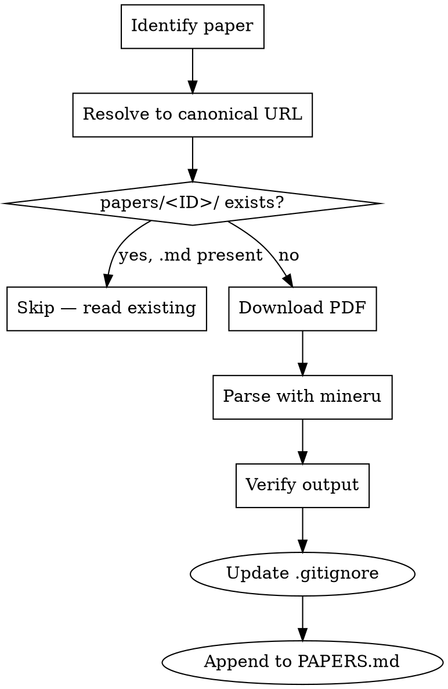

# Fetching Papers

## Overview

Download an academic paper and parse it to markdown + extracted figures using **mineru**, storing results under `./papers/<PAPER-ID>/` with the project's existing convention.

**Core principle:** Paper-ID matches the project's code-dir name when one exists (e.g., `DiffV2IR/` ↔ `papers/DiffV2IR/`). Never invent a new naming scheme if the project already has one.

## When to Use

- User says "download the X paper", "get the paper for Y", "parse this PDF"
- User references a paper by name/abbreviation that isn't yet in `./papers/`
- User wants markdown output of a PDF to read or feed to another tool

**Skip when:** the paper already exists at `papers/<ID>/<ID>.md` — just read it.

## Workflow



## Step 1 — Identify the paper & pick Paper-ID

The user often names a paper by abbreviation (e.g., "PID", "F-ViTA", "DiffV2IR"). Resolve it:

1. **Check existing project layout first** — `ls papers/` and `ls` the project root.
   - If a top-level code dir matches (e.g., `PID/`), **use that name as Paper-ID** (preserve case).
   - Look at sibling `papers/<other>/` entries for the naming style already used.
2. **Grep for citations** in the matching code dir's README, paper-related comments, or `*.bib`:
   ```
   Grep pattern="arxiv|doi|openreview|huggingface.co/papers" path="<code-dir>"
   ```
3. **If no local reference**, ask the user for the arXiv ID / URL / title. Do not guess IDs.

## Step 2 — Resolve to a canonical PDF URL

Try sources in order (use the first that works):

| Source | URL pattern |
|---|---|
| arXiv | `https://arxiv.org/pdf/<ID>.pdf` (strip version for latest) |
| HuggingFace Papers | `https://huggingface.co/papers/<arxiv-id>` → links to PDF |
| OpenReview | `https://openreview.net/pdf?id=<ID>` |
| CVF Open Access | `https://openaccess.thecvf.com/content/<venue>/papers/<...>.pdf` |
| ACL Anthology | `https://aclanthology.org/<ID>.pdf` |
| DOI (Springer/Elsevier/etc.) | resolve via `https://doi.org/<DOI>` |

If the user has the `huggingface-skills:huggingface-papers` skill available, prefer it for HF-indexed papers (gives structured metadata + abstract).

## Step 3 — Ensure mineru is installed

Check the project's Python env first:

- `E:\Code\CMU\lab\RGB2IR` stores env details in `python_environment.md` — **read it** and use that env.
- Otherwise look for `pyproject.toml` / `.venv/` / `requirements.txt`.
- If the user hasn't specified an env, ask before installing.

Install via **uv** into that env:

```bash
# Preferred: install into the project/user-preferred env
uv tool install -U "mineru[core]"
# OR, for one-off use without polluting tool env:
uv run --with "mineru[core]" -- mineru --help
```

Verify: `mineru --version`. If it fails, do not silently fall back to another parser — report the error and ask.

## Step 4 — Download the PDF

```bash
mkdir -p "papers/<ID>"
curl -L -f -o "papers/<ID>/<ID>.pdf" "<resolved-url>"
```

Use `-f` so HTTP errors fail the command. Verify file is a real PDF: `file papers/<ID>/<ID>.pdf` should report `PDF document`.

## Step 5 — Parse with mineru

```bash
mineru -p "papers/<ID>/<ID>.pdf" -o "papers/<ID>/"
```

mineru writes markdown + figures into `papers/<ID>/<ID>/` (nested subdir named after the PDF). That nested layout matches what already exists for `papers/F-ViTA/F-ViTA/`.

Common flags:
- `-b pipeline` (default, CPU/GPU local) vs `-b vlm-transformers` (heavier, better for complex layout)
- `-l en` to pin language and avoid autodetection overhead
- `--formula-enable true --table-enable true` (defaults on; keep on for ML papers)

Run `mineru --help` for the full list.

## Step 6 — Verify

- Read the first ~50 lines of the generated `.md` and confirm title + authors match what the user asked for.
- List the output dir so the user sees what was produced.
- Never claim success without opening the markdown.

## Step 7 — Manage .gitignore (if inside a git repo)

mineru outputs (PDFs, extracted figures, layout debug PDFs, JSON content dumps) are large and binary. They must not be committed.

1. Detect git: check for a `.git/` directory at or above the project root (e.g., `git rev-parse --show-toplevel`). If not a git repo, skip this step.
2. Ensure `.gitignore` at the repo root contains the following block — append it if missing (do **not** duplicate existing lines):

   ```gitignore
   # Papers: large binaries & mineru outputs — tracked via papers/PAPERS.md
   papers/**/*.pdf
   papers/**/images/
   papers/**/*_content_list.json
   papers/**/*_layout.pdf
   papers/**/*_middle.json
   papers/**/*_model.json
   papers/**/*_origin.pdf
   papers/**/*_spans.pdf
   ```

   Keep `papers/**/*.md` **tracked** — the parsed markdown is small and useful in-repo.
3. Verify: `git check-ignore -v papers/<ID>/<ID>.pdf` should report the rule matched.

## Step 8 — Update papers/PAPERS.md

Because PDFs and figures are gitignored, `papers/PAPERS.md` is the **single source of truth** recording what's been fetched, where it came from, and how to re-fetch it.

1. If `papers/PAPERS.md` does not exist, create it using the template below.
2. Append a new entry for this paper. If an entry with the same Paper-ID already exists, update it rather than duplicating.
3. Keep entries sorted alphabetically by Paper-ID.

### PAPERS.md template

````markdown
# Papers Index

This directory stores parsed academic papers. Large files (PDFs, figure images, mineru intermediates) are gitignored — only the parsed `.md` is tracked. Use this index to know which papers have been fetched and how to re-download them.

Re-fetch any paper with the `fetching-papers` skill using its source URL below.

---

## <Paper-ID>

- **Title:** <full paper title>
- **Authors:** <Author1, Author2, et al.>
- **Year / Venue:** <e.g., 2024 / CVPR>
- **Source:** <arXiv | HuggingFace | OpenReview | CVF | ACL | DOI>
- **Source URL:** <canonical landing page, e.g., https://arxiv.org/abs/2401.12345>
- **PDF URL:** <direct PDF link used to download>
- **arXiv ID / DOI:** <id, if applicable>
- **Local path:** `papers/<Paper-ID>/<Paper-ID>/<Paper-ID>.md`
- **Related code dir:** `<./code-dir/>` or `—`
- **Fetched:** <YYYY-MM-DD>
- **Parser:** mineru <version> (backend: `pipeline` | `vlm-transformers`)
- **Summary:** <1–3 sentence TL;DR — what the paper proposes and why this project cares>
- **Tags:** `<tag1>`, `<tag2>`  *(e.g., `rgb2ir`, `diffusion`, `dataset`)*

---
````

### Example filled entry

```markdown
## DiffV2IR

- **Title:** DiffV2IR: Visible-to-Infrared Image Translation via Diffusion Models
- **Authors:** Jane Doe, John Smith, et al.
- **Year / Venue:** 2024 / arXiv preprint
- **Source:** arXiv
- **Source URL:** https://arxiv.org/abs/2403.12345
- **PDF URL:** https://arxiv.org/pdf/2403.12345.pdf
- **arXiv ID / DOI:** 2403.12345
- **Local path:** `papers/DiffV2IR/DiffV2IR/DiffV2IR.md`
- **Related code dir:** `./DiffV2IR/`
- **Fetched:** 2026-04-22
- **Parser:** mineru 1.x (backend: pipeline)
- **Summary:** Proposes a diffusion-based pipeline for translating visible-spectrum images to infrared, conditioning on structural edges to preserve thermal-consistent geometry.
- **Tags:** `rgb2ir`, `diffusion`, `image-translation`
```

## Final layout

```
papers/
  PAPERS.md              ← tracked; index of all fetched papers
  <ID>/
    <ID>.pdf             ← gitignored
    <ID>/
      <ID>.md            ← tracked
      images/            ← gitignored
      <ID>_content_list.json  ← gitignored
      <ID>_layout.pdf    ← gitignored (optional debug)
```

## Common Mistakes

| Mistake | Fix |
|---|---|
| Using marker / pymupdf4llm / pdftotext instead of mineru | User asked for mineru. Use mineru. |
| Flat `papers/<id>.pdf` | Always `papers/<ID>/<ID>.pdf` (matches existing project layout) |
| Lowercasing the ID | Preserve casing of the matching code dir (`DiffV2IR`, not `diffv2ir`) |
| Creating a new venv | Read `python_environment.md` / ask the user; don't spawn `.venv-papers` |
| Guessing arXiv IDs | If no local citation found, ask the user for the URL |
| `pip install mineru` | Use `uv tool install` or `uv run --with` |
| Declaring done without reading the .md | Always verify title/abstract |
| Committing PDFs / figures to git | Add the `papers/**/*.pdf` etc. block to `.gitignore` (Step 7) |
| Skipping `PAPERS.md` update | Without it, re-fetch info is lost since binaries are gitignored |
| Duplicating a `PAPERS.md` entry on re-fetch | Update the existing entry in place |

## Red Flags — STOP

- About to `pip install` instead of `uv tool install`
- About to save as flat `papers/foo.pdf`
- About to guess an arXiv ID without asking
- About to fall back to a non-mineru parser silently
- About to create a new venv without consulting `python_environment.md`
- About to `git add` a PDF or a `papers/<ID>/<ID>/images/` dir
- About to mark the task complete without updating `papers/PAPERS.md`

All of these mean: stop, re-read Steps 1 and 3.
